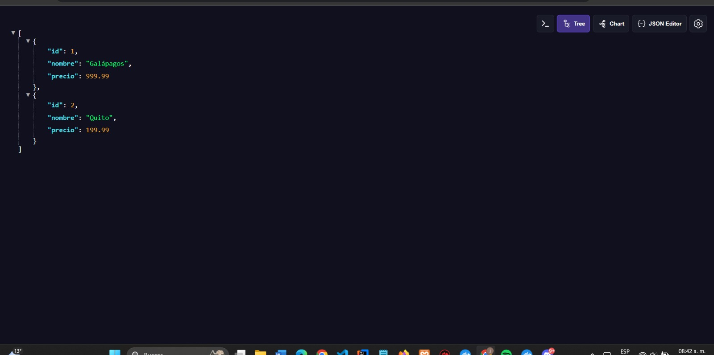

# Despliegue en Producción de una Aplicación Web con Docker y NGINX

## 1. Título
**Despliegue en Producción de una Aplicación Web con Docker y NGINX**

## 2. Tiempo de duración
Aproximadamente **180 minutos**, distribuidos entre la creación de archivos, configuración de servicios, construcción de imágenes y pruebas de despliegue.

## 3. Fundamentos

El despliegue de aplicaciones web modernas suele requerir una arquitectura compuesta por varios servicios: **frontend**, **backend** y **base de datos**. Docker permite empaquetar cada uno de estos servicios en **contenedores independientes** que pueden ejecutarse en cualquier entorno.

**NGINX** es un servidor web ampliamente utilizado para servir archivos estáticos en producción y como proxy reverso para redirigir tráfico al backend.

**Docker Compose** simplifica la orquestación de múltiples contenedores mediante un único archivo `docker-compose.yml`. Este archivo define cómo deben construirse y comunicarse los servicios. Al ejecutar `docker-compose up`, se levantan todos los servicios definidos, interconectados por una red interna.

NGINX se encarga de servir los archivos generados por el proceso de **build del frontend** y también puede actuar como proxy hacia el backend. Su configuración se personaliza mediante un archivo `default.conf`.

**Node.js** se usa para construir (compilar) el proyecto frontend en **React**, generando los archivos estáticos que NGINX utilizará.

## 4. Conocimientos previos

Para realizar esta práctica, el estudiante debe tener conocimientos básicos de:

- Manejo de comandos en la terminal (Linux).
- Uso de Docker y Docker Compose.
- Conceptos de red y puertos.
- Estructura básica de proyectos React.
- Configuración de archivos Dockerfile.
- Manipulación de archivos `.env`.

## 5. Objetivos a alcanzar

- Implementar contenedores Docker para frontend, backend y base de datos.
- Configurar un servidor NGINX que sirva archivos estáticos del frontend.
- Utilizar Docker Compose para orquestar los servicios.
- Construir imágenes personalizadas usando Dockerfile.
- Desplegar la aplicación en un entorno de producción simulado.

## 6. Equipo necesario

- Computadora con sistema operativo: Windows 10/11, Linux o MacOS.
- Docker v24+ y Docker Compose v2+.
- Cuenta en Docker Hub (opcional).
- Editor de texto (Visual Studio Code recomendado).
- Conexión a internet.

## 7. Material de apoyo

- [Documentación oficial de Docker](https://docs.docker.com)
- [Documentación oficial de NGINX](https://nginx.org/en/docs/)
- [React Build - Create React App](https://create-react-app.dev/docs/deployment/)
- Cheatsheet de comandos Linux.
- Guía proporcionada por el docente.
## 8. Procedimiento
### Paso 1. Crear estructura del proyecto
- Creamos una carpeta principal que contiene tres subcarpetas: frontend, backend y el archivo docker-compose.yml. Esto permite mantener separados los componentes de la aplicación, lo que facilita la organización y el despliegue.

### Paso 2.Dentro de backend/,
-  Se configuró un servidor con Express.js que expone rutas REST para manejar clientes, destinos y reservas. El archivo principal app.js:

### Paso 3. Base de datos PostgreSQL
- Dentro de database/, se creó un archivo init.sql que define las siguientes tablas

### Paso 4. Frontend con React

- En frontend/ se utilizó create-react-app para crear una aplicación básica. Se modificó el componente App.js para que, en lugar de mostrar el logo de React, muestre un diseño personalizado relacionado con las tablas de reservas, destinos y clientes.

### Paso 5. Configuración de NGINX
- Se creó un contenedor con NGINX para servir los archivos estáticos de React en modo producción. El archivo default.conf contiene:

### Paso  6. Dockerfile del Backend
- El Dockerfile del backend usa una imagen de node:alpine, copia los archivos, instala dependencias y expone el puerto 3000:

## Paso 7. Dockerfile del Frontend
- El frontend utiliza un Dockerfile multietapa:

### Paso 8. docker-compose.yml
Este archivo orquesta los tres contenedores: frontend, backend y base de datos. También define redes, puertos y dependencias.

### Paso 9. Levantamiento del Proyecto
Para iniciar todo el entorno, se usaron los comandos:

**Capturas esperadas:**

- Visualización del contenedor frontend activo en Docker Desktop.
- Salida de consola de `docker-compose up`.
- Pantalla de bienvenida del frontend en el navegador.

### Paso 10.  Visualización
- Una vez iniciado el proyecto:

- El backend está accesible en: http://localhost:3000/api/...

- El frontend en producción está en: http://localhost:8080

**Capturas esperadas:**

- Visualización del contenedor frontend activo en Docker Desktop.
- Salida de consola de `docker-compose up`.
- Pantalla de bienvenida del frontend en el navegador.
### Conclusiones

1. **Docker** permitió desplegar de forma eficiente una aplicación completa con frontend, backend y base de datos.  
2. El uso de **NGINX** facilitó servir los archivos del frontend y conectar correctamente con el backend.  
3. Automatizar la base de datos con `init.sql` evitó errores y aseguró un entorno listo para usar.  
4. Personalizar el frontend permitió visualizar la información real de las tablas, superando la interfaz por defecto.  
5. Este proyecto fortaleció el manejo práctico de contenedores y la integración de servicios modernos en producción.

## 10. Bibliografía

- Docker Inc. (2024). *Docker Documentation*. https://docs.docker.com  
- NGINX, Inc. (2024). *NGINX Documentation*. https://nginx.org/en/docs/  
- Facebook. (2024). *Create React App*. https://create-react-app.dev  
- Villalobos, J. (2022). *Despliegue con Docker*. Editorial Alfaomega.
